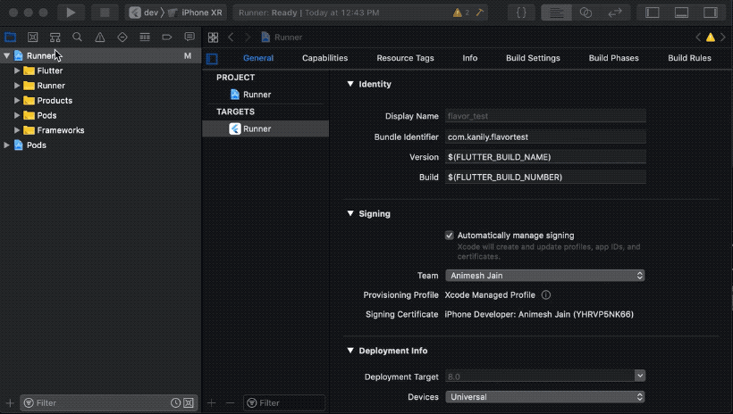

# Flavors

- Baseado no artigo do Animesh Jain [Build Flavors in Flutter](https://medium.com/@animeshjain/build-flavors-in-flutter-android-and-ios-with-different-firebase-projects-per-flavor-27c5c5dac10b)

- Criar um novo Projeto: 

```sh
> flutter create -i swift -a kotlin app
```
ou 
```
> flutter create -i swift -a kotlin --org br.com.thyagoluciano app
```

- Opcional Configurar Firebase
    - Você pode seguir as intruções detalhadas de como configurar o firebase no seu projeto aqui: [Configuração do Firebase](https://firebase.google.com/docs/flutter/setup)
    - Você pode ver como configurar multiprojetos do firebase aqui: [Configurar vários projetos](https://firebase.google.com/docs/projects/multiprojects)

    Exemplo de estrutura de diretorio android:
    ```
    .
    ├── .gitignore
    ├── app
    │   ├── build.gradle
    │   └── src
    │       ├── debug
    │       │   └── AndroidManifest.xml
    │       ├── dev
    │       │   └── google-services.json
    ```
    - Diff configurando firebase: [Step 2 - Configurar Firebase](https://github.com/thyagoluciano/flutter-boilerplate/commit/1818b657b930a8a869741b39e5c181ad6ecf3fd8)

- Configuração Flavor Android [Step 3 - Configurar Flavor Android](https://github.com/thyagoluciano/flutter-boilerplate/commit/715a4c6de591c17df82ca7ee1b1e8e060e009bc4)

- Configurar Flavor iOS [Step 4 - Configurar Flavor iOS]()

    - Criar um novo schema chamado dev

    

    - Configuração de compilação duplicada para criar Debug-dev e similares

    

    - Renomear o esquema padrão e as configurações de build para prod

    

    - Conectar as configurações de build dev ao schema dev

    

    - Atualizar o identificador de pacote para configurações de compilação de produto

    

    - Atualizar o arquivo: ios > Runner > info.plist

    ```
    <dict> 
        ... 
        <key> CFBundleDisplayName </key> 
        <string> $ (APP_DISPLAY_NAME) </string> 
        ... 
    </dict>
    ```

     - Definir um nome de exibição de aplicativo personalizado por configuração de build

    

    - Copiar os arquivos GoogleServices-info.plist para um diretorio de configuração seraparado e crie um link para esse diretorio no XCode

    

    - Crie uma fase de compilação RunScript para copiar os arquivos GoogleServices-info.plist para o local padrão no pacote do aplicativo

    

    ```
    environment="default"

    # Regex to extract the scheme name from the Build Configuration
    # We have named our Build Configurations as Debug-dev, Debug-prod etc.
    # Here, dev and prod are the scheme names. This kind of naming is required by Flutter for flavors to work.
    # We are using the $CONFIGURATION variable available in the XCode build environment to extract 
    # the environment (or flavor)
    # For eg.
    # If CONFIGURATION="Debug-prod", then environment will get set to "prod".
    if [[ $CONFIGURATION =~ -([^-]*)$ ]]; then
    environment=${BASH_REMATCH[1]}
    fi

    echo $environment

    # Name and path of the resource we're copying
    GOOGLESERVICE_INFO_PLIST=GoogleService-Info.plist
    GOOGLESERVICE_INFO_FILE=${PROJECT_DIR}/config/${environment}/${GOOGLESERVICE_INFO_PLIST}

    # Make sure GoogleService-Info.plist exists
    echo "Looking for ${GOOGLESERVICE_INFO_PLIST} in ${GOOGLESERVICE_INFO_FILE}"
    if [ ! -f $GOOGLESERVICE_INFO_FILE ]
    then
    echo "No GoogleService-Info.plist found. Please ensure it's in the proper directory."
    exit 1
    fi

    # Get a reference to the destination location for the GoogleService-Info.plist
    # This is the default location where Firebase init code expects to find GoogleServices-Info.plist file
    PLIST_DESTINATION=${BUILT_PRODUCTS_DIR}/${PRODUCT_NAME}.app
    echo "Will copy ${GOOGLESERVICE_INFO_PLIST} to final destination: ${PLIST_DESTINATION}"

    # Copy over the prod GoogleService-Info.plist for Release builds
    cp "${GOOGLESERVICE_INFO_FILE}" "${PLIST_DESTINATION}"
    ```